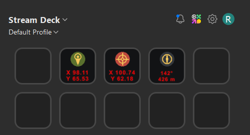

# WARDOGS ARTILLERY CALCULATOR
> **EINSATZANLEITUNG • STREAM DECK INTEGRATION • MÖRSER-SCHNELLRECHNER**  
> Dokument-ID: `SOP-ARTY-01` | Version: `V1.0` | Ziel-Plattform: **Windows 11**

---

## 🎯 Übersicht & Systemvoraussetzungen

Das **Wardogs Artillery Plugin** (`de.wardogs.artillery.sdPlugin`) ermöglicht das blitzschnelle Berechnen und Übermitteln ballistischer Richtwerte (Azimut & Distanz) direkt auf das Elgato Stream Deck. Der Gefechtsfluss bleibt ungestört: Kein Tabben, keine externen Web-Tools – alle Berechnungen laufen im Hintergrund über die Zwischenablage und werden direkt auf den Tasten-Displays visualisiert.

- **Betriebssystem:** Windows 11 (kompatibel mit Windows 10)
- **Software:** Elgato Stream Deck Software ab Version 6.x
- **Plugin-ID:** `de.wardogs.artillery.sdPlugin`
- **Hersteller / Clan:** h04ry / S4CK

---

## ■ 1. EINBINDUNG IN STREAM DECK (EINMALIG)

1. **Stream Deck beenden:**  
   Rechtsklick auf das Stream-Deck-Symbol im Infobereich der Windows-Taskleiste (System Tray) > **Beenden**.
2. **Ordner platzieren:**  
   Kopiere den Plugin-Ordner `de.wardogs.artillery.sdPlugin` in das Standard-Pluginverzeichnis unter Windows 11:
   ```text
   %appdata%\Elgato\StreamDeck\Plugins\de.wardogs.artillery.sdPlugin
   ```
   *(Vollständiger Pfad: `C:\Users\<DeinBenutzername>\AppData\Roaming\Elgato\StreamDeck\Plugins\de.wardogs.artillery.sdPlugin`)*
3. **Software starten:**  
   Öffne die Elgato Stream Deck Desktop-App. Im rechten Aktionskatalog erscheint die neue Kategorie **WarDogs**.
4. **Tasten belegen:**  
   Ziehe die drei verfügbaren Aktionen nebeneinander auf dein Tastendeck (Layout siehe Abschnitt 2).

---

## ■ 2. TASTEN-LAYOUT AUF DEM DECK

Platziere die drei Tasten nebeneinander, um einen reibungslosen Workflow zu gewährleisten:

| Taste 1 | Taste 2 | Taste 3 |
| :---: | :---: | :---: |
| **`[SET POS]`** | **`[SET TARGET]`** | **`[195° / 434 m]`** |
| **EIGENE POSITION** | **FEIND / ZIEL** | **AUSRICHT-DATEN** |
| Erfasst den Mörser-Standort direkt aus der Zwischenablage | Erfasst Zielkoordinaten direkt aus der Zwischenablage | Berechnet & visualisiert Azimut und Distanz in Echtzeit |

---

## ■ 3. TAKTISCHER ABLAUF IM GEFECHT (IN-GAME WORKFLOW)

```text
+---------------------+     +-----------------------+     +------------------------+     +------------------+
| 01: EIGENE POSITION | --> | 02: ZIELKOORDINATEN   | --> | 03: FEUERLEITSYSTEM    | --> | 04: FEUER FREI!  |
| Strg + C -> SET POS |     | Strg + C -> SET TARGET|     | Azimut & Distanz lesen |     | Mörser ausrichten|
+---------------------+     +-----------------------+     +------------------------+     +------------------+
```

1. **01 Eigene Position erfassen:**  
   Mörser-Standort auf der Ingame-Karte ablesen oder im Chatfenster markieren und mit <kbd>Strg</kbd> + <kbd>C</kbd> kopieren. Unmittelbar danach auf dem Deck die Taste **`[SET POS]`** drücken. Die Taste quittiert die Übernahme mit einem grünen Haken.
2. **02 Zielposition erfassen:**  
   Feindkoordinaten vom Spotter oder Karten-Ping im Chat markieren und mit <kbd>Strg</kbd> + <kbd>C</kbd> kopieren. Danach sofort auf dem Deck die Taste **`[SET TARGET]`** drücken.
3. **03 Feuerleitsystem ablesen:**  
   Taste 3 (**Azimuth & Range**) kalkuliert das Ziel sofort und gibt die finalen Richtwerte aus:
   - **Obere Zeile:** Azimut / Kompasskurs in Grad (z. B. `195°`)
   - **Untere Zeile:** Distanz in Metern (z. B. `434 m`)
4. **04 Mörser ausrichten & Feuern:**  
   Mörser horizontal auf den Kompasskurs drehen, vertikalen Höhenrichtwert (Elevation) auf die berechnete Meter-Distanz einstellen und Feuer eröffnen.
   
##Demo Stream Deck


---

## ℹ️ HINWEISE ZUM KOORDINATEN-PARSER

Der im Plugin integrierte Zwischenablage-Parser akzeptiert flexible Textformate, sodass Chatnachrichten ohne Vorformatierung übernommen werden können:

- **Formatierte Strings:** z. B. `X: 84.62 Y: 71.25` oder `x84.62 y71.25`
- **Reine Zahlenpaare:** z. B. `84.62, 71.25` oder `84.62 71.25`
- **Zielwechsel:** Solange der Mörser nicht verlegt wird, muss bei einem neuen Ziel **ausschließlich Schritt 02** wiederholt werden. Die eigene Position bleibt persistent gespeichert.

---

## 📂 Dateistruktur

```text
de.wardogs.artillery.sdPlugin/
├── bin/
│   ├── calc.js          # Mathematische Vektorberechnung (Azimut & Distanz)
│   ├── clipboard.js     # Zwischenablage-Listener & Regex-Extraktion
│   ├── plugin.js        # Stream Deck Lifecycle- & Event-Verwaltung
│   └── ws-client.js     # Lokale WebSocket-Kommunikation mit der Elgato-Software
├── imgs/
│   ├── actions/         # Key-Icons (SET POS, SET TARGET, Azimuth)
│   └── plugin/          # Kategorie- und Store-Grafiken
├── pi/
│   ├── pi.html          # Property Inspector (Einstellungsmaske)
│   └── pi.js            # Frontend-Logik für Property Inspector
├── manifest.json        # Stream Deck Plugin-Konfiguration
└── README.md            # Dokumentation & Einsatzhandbuch
```

---
*S4CK SOFTWARE • ARTILLERY UNIT FIELD MANUAL V1.0 • SEITE 1 VON 1*